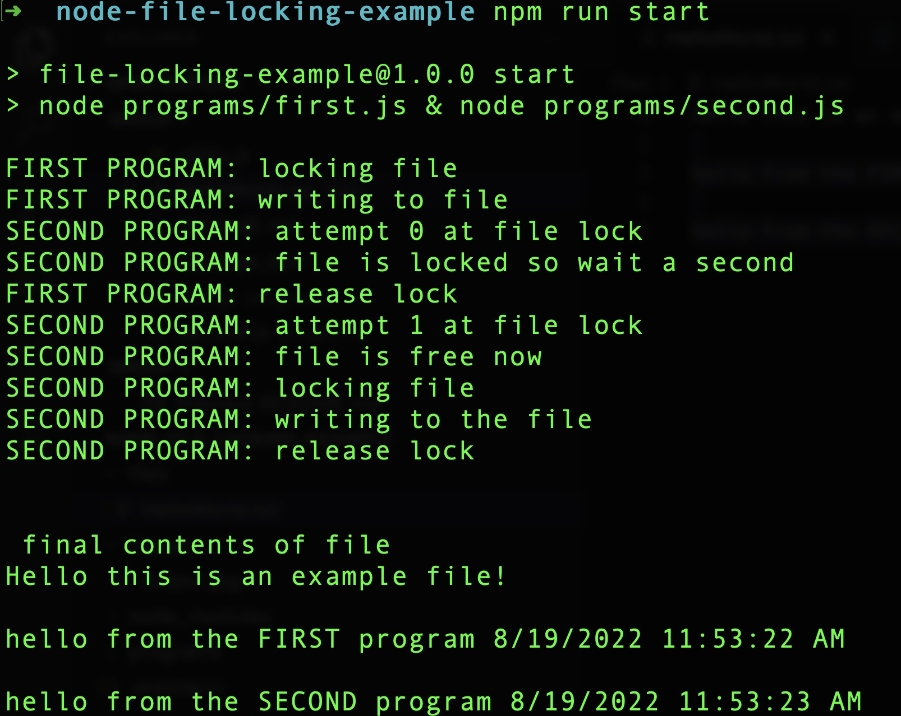

# Node File Locking Example

This is a sample project that goes along with my post "Understanding Node.js File Locking" on LogRocket's blog. I will update this README with a link once the post is live.

This project is very simple, but basically showcases file locking in Node.js. The project uses [proper-lockfile](https://www.npmjs.com/package/proper-lockfile) to control access to a file that two programs write to.

If you run the npm script `start` then you'll see the two programs attempting to access the file:

The programs that run in the start script are in the `programs` folder.

I also created some small utility functions to do the actual writing to the file and achieving a sleep in the `utility.js` file.

Thanks for checking out this repo!
